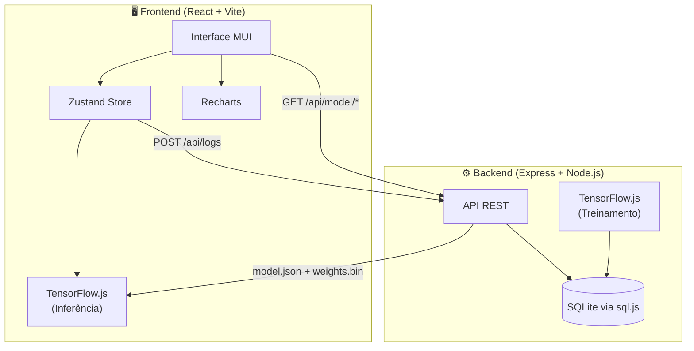
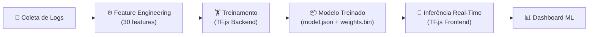

# 🛡️ Análise Comportamental com Machine Learning

**TCC — Bacharelado em Sistemas de Informação**
Universidade Federal de Uberlândia (UFU) — Campus Monte Carmelo, MG

**Autor:** Kayo Galdino Gomes Rocha

Node.js
React
TypeScript
TensorFlow.js
MUI
SQLite

---

## 📋 Sobre o Projeto

Sistema de **detecção de comportamentos suspeitos** em um ERP de corretagem de café utilizando **Machine Learning**. O sistema coleta logs de atividades dos usuários em tempo real, extrai features comportamentais e classifica cada ação como normal ou suspeita por meio de uma rede neural treinada com TensorFlow.js.

### Problema

Sistemas corporativos (ERPs) são alvos frequentes de atividades indevidas desde vazamento de dados até comprometimento de contas. Abordagens tradicionais baseadas em regras estáticas são limitadas na capacidade de detectar padrões sutis e adaptar-se a novos vetores de ataque.

### Hipótese

> A classificação supervisionada com TensorFlow.js **supera regras estáticas** na detecção de anomalias comportamentais em logs de sistemas ERP.

### Resultado Alcançado


| Métrica      | Modelo ML  | Regras Estáticas | Melhoria   |
| ------------ | ---------- | ---------------- | ---------- |
| **F1-Score** | **99.37%** | 72.79%           | **+36.5%** |
| Accuracy     | 99.38%     | 84.25%           | +18.0%     |
| Precision    | 99.54%     | 58.56%           | +70.0%     |
| Recall       | 99.21%     | 96.27%           | +3.1%      |
| AUC-ROC      | 0.9998     | —                | —          |


> ⚠️ **Nota:** Métricas obtidas com dataset sintético (ver [Limitações](#limitações)).

---

## 🏗️ Arquitetura do Sistema

### Visão Geral




### Decisões Arquiteturais


| Decisão                               | Justificativa                                                                                                                                            |
| ------------------------------------- | -------------------------------------------------------------------------------------------------------------------------------------------------------- |
| **TF.js no backend** para treino      | Permite treinar o modelo em ambiente Node.js com acesso ao dataset completo, sem expor dados ao navegador                                                |
| **TF.js no frontend** para inferência | Classificação em tempo real no navegador sem latência de rede, modelo carregado uma única vez                                                            |
| **SQLite (sql.js)**                   | Banco embeddable em puro JavaScript, sem necessidade de compilação nativa — ideal para portabilidade acadêmica                                           |
| **Dataset sintético**                 | Dados reais de ameaças em ERPs não estão disponíveis publicamente; a geração sintética com perfis controlados permite validação reprodutível da hipótese |


### Pipeline de Machine Learning




### Categorias de Features (30 features)

#### 🌐 Ambiente (9 features)


| Feature                | Descrição                                             |
| ---------------------- | ----------------------------------------------------- |
| `hourOfDay`            | Hora do dia da ação (0-23)                            |
| `dayOfWeek`            | Dia da semana (0=domingo, 6=sábado)                   |
| `accessLevelEncoded`   | Nível de acesso codificado (guest=1, user=2, admin=3) |
| `networkLatency`       | Latência da rede em milissegundos                     |
| `geoDistanceFromUsual` | Distância geográfica do local habitual (km)           |
| `ipChangeFlag`         | Indicador de mudança de endereço IP                   |
| `loginAttempts`        | Número de tentativas de login na sessão               |
| `inactivitySeconds`    | Tempo de inatividade em segundos                      |
| `isNewDevice`          | Indicador de dispositivo nunca visto antes            |


#### 🧠 Comportamento (8 features)


| Feature                    | Descrição                                                  |
| -------------------------- | ---------------------------------------------------------- |
| `actionFrequency`          | Quantidade de ações na janela temporal (últimas 50 ações)  |
| `actionVariety`            | Diversidade de tipos de ações distintas                    |
| `actionSequenceEntropy`    | Entropia de Shannon da sequência de ações                  |
| `moduleAccessCount`        | Número de módulos distintos acessados                      |
| `sensitiveDataAccessCount` | Acessos a módulos sensíveis (Contratos/Gestão)             |
| `errorRate`                | Proporção de operações com erro                            |
| `avgTimeBetweenActions`    | Tempo médio entre ações consecutivas (segundos)            |
| `burstScore`               | Quantidade de ações no último minuto (indicador de rajada) |


#### 📄 Contexto (13 features)


| Feature                                            | Descrição                                         |
| -------------------------------------------------- | ------------------------------------------------- |
| `actionTypeCreate/Read/Update/Delete/Login/Config` | One-hot encoding do tipo de ação (6 dimensões)    |
| `moduleClientes/Empresa/Contratos/Gestao/Sistema`  | One-hot encoding do módulo acessado (5 dimensões) |
| `resultEncoded`                                    | Resultado da operação (1=sucesso, 0=erro)         |
| `sessionDurationMinutes`                           | Duração da sessão atual em minutos                |


---

## 🛠️ Tecnologias Utilizadas


| Tecnologia            | Versão | Propósito                                                  |
| --------------------- | ------ | ---------------------------------------------------------- |
| **React**             | 18.3   | Interface do usuário (SPA)                                 |
| **TypeScript**        | 5.5    | Tipagem estática em todo o projeto                         |
| **Vite**              | 5.4    | Bundler e dev server                                       |
| **Zustand**           | 4.5    | Gerenciamento de estado (stores)                           |
| **MUI (Material UI)** | 7.3    | Biblioteca de componentes UI                               |
| **MUI X DataGrid**    | 8.27   | Tabela avançada com filtros, ordenação e exportação CSV    |
| **Recharts**          | 3.7    | Gráficos customizados (curva de aprendizado, anomalias)    |
| **TensorFlow.js**     | 4.22   | Treinamento (backend) e inferência (frontend) do modelo ML |
| **Express**           | 4.21   | Servidor HTTP e API REST                                   |
| **SQLite (sql.js)**   | 1.11   | Banco de dados embeddable (logs, métricas, alertas)        |
| **Node.js**           | 18+    | Runtime do servidor                                        |
| **jsPDF**             | 2.5    | Geração de contratos em PDF                                |


---

## 📦 Pré-requisitos

- **Node.js** v18 ou superior ([download](https://nodejs.org/))
- **npm** v9 ou superior (incluso no Node.js)
- **Git** ([download](https://git-scm.com/))

### Portas Utilizadas


| Porta  | Serviço                    |
| ------ | -------------------------- |
| `3001` | Backend (Express API)      |
| `5173` | Frontend (Vite dev server) |


---

## 🚀 Passo a Passo para Rodar

### Etapa 1 — Clonar o repositório

```bash
git clone <url-do-repositorio>
cd PROJETO-TCC-UFU
```

### Etapa 2 — Instalar dependências do backend

```bash
cd server
npm install
```

### Etapa 3 — Gerar o dataset sintético

```bash
npm run generate-dataset
```

**O que acontece:**

- São gerados **8.000 amostras** rotuladas (70% normal, 30% suspeito)
- **6 perfis de usuário** são simulados:
  - ✅ **Normal Office Worker** — funcionário comum, horário comercial, ações moderadas
  - ✅ **Normal Manager** — gerente com acesso admin, mais módulos, jornada estendida
  - ❌ **Data Exfiltration** — alta frequência, horário noturno, foco em dados sensíveis
  - ❌ **Privilege Escalation** — nível guest tentando acessar módulos restritos, alta taxa de erro
  - ❌ **Account Compromise** — variação de IP/dispositivo/geolocalização, padrão errático
  - ❌ **Insider Threat** — admin acessando dados fora do horário, foco em contratos
- 30 features são extraídas de cada log e normalizadas (min-max)
- O dataset é salvo em `server/data/synthetic/dataset.json`
- Estatísticas das features são salvas no banco de dados

### Etapa 4 — Treinar o modelo de Machine Learning

```bash
npm run train
```

**O que acontece:**

- O dataset é dividido em **70% treino / 15% validação / 15% teste**
- Uma rede neural densa é treinada por **50 epochs** (batch size 64)
- O modelo é avaliado no conjunto de teste e comparado com o baseline de regras
- O treinamento leva aproximadamente **30-60 segundos** dependendo do hardware

**Arquivos gerados em `server/data/trained/`:**


| Arquivo                 | Descrição                                      |
| ----------------------- | ---------------------------------------------- |
| `model.json`            | Topologia da rede neural (formato TF.js)       |
| `weights.bin`           | Pesos treinados em binário                     |
| `learning_curve.json`   | Loss e acurácia por época (treino e validação) |
| `confusion_matrix.json` | Matrizes de confusão do ML e do baseline       |
| `feature_stats.json`    | Estatísticas de normalização das features      |


### Etapa 5 — Iniciar o backend

```bash
npm run dev
```

O servidor Express inicia na porta **3001** com as seguintes capacidades:

- API REST para logs, alertas e modelo ML
- Servir o modelo treinado para o frontend
- Banco de dados SQLite persistido em `server/data/raa.db`

use `npx kill-port 3001` para matar o processo se a porta estiver ocupada.


### Etapa 6 — Iniciar o frontend (segundo terminal)

```bash
cd ..
npm install
npm run dev
```

O Vite inicia na porta **5173** com hot module replacement.

### Etapa 7 — Acessar o sistema

Abra o navegador em **[http://localhost:5173](http://localhost:5173)** e navegue pelos módulos:


| Módulo                  | Descrição                                                             |
| ----------------------- | --------------------------------------------------------------------- |
| **Clientes**            | CRUD de clientes da corretora (cadastro, edição, exclusão)            |
| **Empresa**             | Cadastro e atualização dos dados da empresa                           |
| **Contratos**           | Geração de contratos de compra/venda de café com exportação PDF       |
| **Gestão de Contratos** | Acompanhamento de status e gerenciamento de contratos ativos          |
| **Logs do Sistema**     | DataGrid com todos os logs, filtros, busca e exportação CSV           |
| **Dashboard ML**        | Métricas, alertas, scores de risco, gráficos e análise de overfitting |


> 💡 **Dica:** Cada ação no ERP gera logs automaticamente. O modelo ML classifica cada ação em tempo real e exibe alertas no Dashboard quando detecta comportamento suspeito.

---

## 🔌 Rotas da API

Base URL: `http://localhost:3001/api`

### Logs


| Método | Rota          | Descrição                                                                                          |
| ------ | ------------- | -------------------------------------------------------------------------------------------------- |
| `POST` | `/logs`       | Persiste um log de atividade                                                                       |
| `POST` | `/logs/batch` | Persiste múltiplos logs em lote                                                                    |
| `GET`  | `/logs`       | Lista logs com paginação e filtros (`userId`, `startDate`, `endDate`, `limit`, `offset`)           |
| `GET`  | `/logs/stats` | Estatísticas agregadas: total de logs, usuários únicos, distribuição por ação/módulo, taxa de erro |


### Alertas


| Método | Rota              | Descrição                                                                    |
| ------ | ----------------- | ---------------------------------------------------------------------------- |
| `GET`  | `/alerts`         | Lista alertas de risco com filtros (`userId`, `minScore`, `limit`, `offset`) |
| `GET`  | `/alerts/summary` | Resumo: riscos por usuário, alertas por tipo, ML vs. Regras                  |


### Modelo ML


| Método | Rota                      | Descrição                                                                |
| ------ | ------------------------- | ------------------------------------------------------------------------ |
| `GET`  | `/model/latest`           | Serve o `model.json` do modelo treinado (formato TF.js)                  |
| `GET`  | `/model/metrics`          | Métricas de treinamento armazenadas no banco                             |
| `GET`  | `/model/feature-stats`    | Estatísticas de normalização das features                                |
| `GET`  | `/model/learning-curve`   | Dados da curva de aprendizado (loss/accuracy por época)                  |
| `GET`  | `/model/confusion-matrix` | Matrizes de confusão do ML e baseline                                    |
| `GET`  | `/model/:filename`        | Serve arquivos de pesos (`.bin`) — rota sanitizada contra path traversal |


---

## 📂 Estrutura de Diretórios

```
PROJETO-TCC-UFU/
├── src/                              # ── Frontend (React) ──
│   ├── components/
│   │   ├── dashboard/
│   │   │   ├── RiskDashboard.tsx      # Painel principal do dashboard ML
│   │   │   ├── MetricsPanel.tsx       # Métricas comparativas ML vs. regras
│   │   │   ├── AlertsPanel.tsx        # Alertas de risco em tempo real
│   │   │   ├── UserRiskScore.tsx      # Score de risco por usuário
│   │   │   ├── AnomalyChart.tsx       # Gráfico de risco ao longo do tempo
│   │   │   ├── FeatureImportance.tsx  # Importância relativa das features
│   │   │   ├── LearningCurveChart.tsx # Curva de aprendizado + diagnóstico de overfitting
│   │   │   └── ConfusionMatrixChart.tsx # Matriz de confusão visual
│   │   ├── forms/
│   │   │   ├── ClientForm.tsx         # Formulário de cadastro de clientes
│   │   │   ├── CompanyForm.tsx        # Formulário de dados da empresa
│   │   │   └── ContractForm.tsx       # Formulário de geração de contratos
│   │   ├── modals/
│   │   │   ├── ClientModal.tsx        # Dialog de visualização/edição de cliente
│   │   │   ├── ContractModal.tsx      # Dialog de detalhes do contrato
│   │   │   └── DeleteConfirmationModal.tsx # Dialog de confirmação de exclusão
│   │   ├── shared/
│   │   │   └── AddressFields.tsx      # Campos reutilizáveis de endereço
│   │   ├── Layout.tsx                 # AppBar + Drawer lateral (navegação MUI)
│   │   ├── SystemLogs.tsx             # Tabela de logs com DataGrid MUI X
│   │   ├── ClientList.tsx             # Lista de clientes com busca
│   │   ├── ContractManagement.tsx     # Gestão de contratos
│   │   ├── ContractPreview.tsx        # Visualização e exportação PDF de contratos
│   │   └── GeolocationProvider.tsx    # Provider de geolocalização e IP
│   ├── ml/
│   │   ├── modelLoader.ts            # Carregamento do modelo TF.js no browser
│   │   ├── inferenceEngine.ts         # Classificação em tempo real + regras estáticas
│   │   └── featureEngineering.ts      # Extração de features para inferência
│   ├── store/
│   │   ├── useLogStore.ts             # Store Zustand para logs e sessão
│   │   └── useMLStore.ts             # Store Zustand para predições e alertas ML
│   ├── services/
│   │   └── api.ts                     # Funções de comunicação com a API
│   ├── types/
│   │   └── index.ts                   # Tipos TypeScript compartilhados + definição de features
│   ├── App.tsx                        # Componente raiz com rotas e estado global
│   ├── main.tsx                       # Entry point com ThemeProvider MUI
│   ├── theme.ts                       # Tema MUI customizado (paleta azul/cinza corporativa)
│   └── index.css                      # Import de fonte Inter
│
├── server/                            # ── Backend (Express + Node.js) ──
│   ├── src/
│   │   ├── db/
│   │   │   ├── connection.ts          # Conexão sql.js (SQLite embeddable)
│   │   │   └── schema.ts             # DDL das tabelas (logs, alertas, métricas)
│   │   ├── ml/
│   │   │   ├── datasetGenerator.ts    # Gerador de dataset sintético (6 perfis)
│   │   │   ├── featureEngineering.ts  # Extração e normalização de features
│   │   │   ├── evaluator.ts          # Avaliação do modelo + baseline de regras (8 regras)
│   │   │   ├── trainer.ts            # Treinamento da rede neural com TF.js
│   │   │   └── hyperparamSearch.ts   # Busca de hiperparâmetros com k-fold CV
│   │   ├── routes/
│   │   │   ├── logs.ts               # CRUD de logs
│   │   │   ├── alerts.ts             # Consulta de alertas e resumos
│   │   │   └── model.ts              # Servir modelo, métricas, pesos
│   │   ├── index.ts                   # Entry point do servidor Express
│   │   └── sql.js.d.ts              # Type declarations para sql.js
│   ├── data/
│   │   ├── synthetic/
│   │   │   └── dataset.json          # Dataset gerado (8000 amostras)
│   │   └── trained/
│   │       ├── model.json            # Topologia do modelo
│   │       ├── weights.bin           # Pesos binários
│   │       ├── learning_curve.json   # Histórico de treino
│   │       ├── confusion_matrix.json # Matrizes de confusão
│   │       └── feature_stats.json    # Stats de normalização
│   ├── package.json
│   └── tsconfig.json
│
├── package.json                       # Dependências do frontend
├── vite.config.ts                     # Configuração do Vite
├── tsconfig.json                      # Configuração TypeScript
├── index.html                         # HTML template
└── README.md                          # Este arquivo
```

---

## 🧠 O Modelo de Machine Learning

### Arquitetura da Rede Neural

```
┌─────────────────────────────────────────────────┐
│  Input Layer              (30 features)          │
├─────────────────────────────────────────────────┤
│  Dense(64, ReLU)          + L2(0.001)           │
│  BatchNormalization                              │
│  Dropout(0.3)                                    │
├─────────────────────────────────────────────────┤
│  Dense(32, ReLU)          + L2(0.001)           │
│  BatchNormalization                              │
│  Dropout(0.2)                                    │
├─────────────────────────────────────────────────┤
│  Dense(16, ReLU)                                 │
├─────────────────────────────────────────────────┤
│  Dense(1, Sigmoid)        → P(suspeito)         │
└─────────────────────────────────────────────────┘

Total de parâmetros treináveis: 4.993
```

### Configuração de Treinamento


| Parâmetro        | Valor                                                    |
| ---------------- | -------------------------------------------------------- |
| Optimizer        | Adam (learning rate = 0.001)                             |
| Loss function    | Binary Crossentropy                                      |
| Epochs           | 50                                                       |
| Batch size       | 64                                                       |
| Regularização    | L2 (λ = 0.001), Dropout (0.3 / 0.2), Batch Normalization |
| Split do dataset | 70% treino / 15% validação / 15% teste                   |
| Dataset          | 8.000 amostras (70% normal, 30% suspeito)                |


### Hyperparameter Tuning

O script `npm run hyperparam-search` realiza uma busca de hiperparâmetros com **5-fold cross-validation**, testando combinações de:

- Número de unidades por camada
- Taxa de dropout
- Learning rate
- Fator de regularização L2

A melhor configuração é selecionada pelo F1-Score médio entre os folds.

### Métricas Finais (Conjunto de Teste)


| Métrica   | Modelo ML  | Baseline de Regras |
| --------- | ---------- | ------------------ |
| Accuracy  | 99.38%     | 84.25%             |
| Precision | 99.54%     | 58.56%             |
| Recall    | 99.21%     | 96.27%             |
| F1-Score  | **99.37%** | **72.79%**         |
| AUC-ROC   | 0.9998     | —                  |


### Baseline de Regras Estáticas (8 regras)

O baseline implementa 8 heurísticas de segurança. Uma ação é classificada como **suspeita se 2 ou mais regras** forem ativadas simultaneamente:


| #   | Regra                              | Threshold                        |
| --- | ---------------------------------- | -------------------------------- |
| 1   | Alta frequência de ações           | > 50 ações na janela temporal    |
| 2   | Acesso fora do horário comercial   | 22h às 6h                        |
| 3   | Múltiplas tentativas de login      | > 3 tentativas                   |
| 4   | Mudança de endereço IP             | IP diferente do habitual         |
| 5   | Alta taxa de erros                 | > 20% das operações              |
| 6   | Rajada de atividade (burst)        | > 5 ações em 1 minuto            |
| 7   | Acesso excessivo a dados sensíveis | > 20 acessos a módulos restritos |
| 8   | Distância geográfica anômala       | > 100 km do local habitual       |


### Limitações

> ⚠️ Os perfis de comportamento do **dataset sintético** possuem padrões bem definidos e separáveis por design. Em cenários reais, comportamentos legítimos e maliciosos tendem a se sobrepor de forma mais sutil, resultando em **métricas inferiores** às reportadas. Esta ressalva é fundamental para a seção de limitações da monografia.

---

## 📊 Dashboard ML

O dashboard apresenta 7 painéis interativos para monitoramento e análise:


| Painel                   | Descrição                                                                                                                                                  |
| ------------------------ | ---------------------------------------------------------------------------------------------------------------------------------------------------------- |
| **MetricsPanel**         | Cards com Accuracy, Precision, Recall, F1-Score e AUC-ROC; comparativo ML vs. regras com percentual de melhoria; nota sobre limitação do dataset sintético |
| **AlertsPanel**          | Lista de alertas em tempo real com score de risco, tipo de alerta (ML ou Regra), usuário e timestamp; badge com contagem total                             |
| **UserRiskScore**        | Ranking de usuários por score de risco com barras de progresso coloridas (verde/amarelo/vermelho)                                                          |
| **ConfusionMatrixChart** | Matrizes de confusão 2x2 lado a lado (ML e Regras) com heatmap colorido, valores absolutos e percentuais                                                   |
| **LearningCurveChart**   | Gráficos de loss e acurácia por época (treino vs. validação) com diagnóstico automático de overfitting (saudável/leve/severo)                              |
| **AnomalyChart**         | Gráfico de área mostrando score de risco médio e máximo ao longo do tempo                                                                                  |
| **FeatureImportance**    | Gráfico de barras horizontal com as 15 features mais discriminantes entre comportamento normal e suspeito                                                  |


> 📷 *Screenshots podem ser adicionados em versão futura da documentação.*

---

## 📚 Referências Acadêmicas

1. **Du, M., Li, F., Zheng, G., & Srikumar, V.** (2017). *DeepLog: Anomaly Detection and Diagnosis from System Logs through Deep Learning*. ACM CCS 2017.
2. **Berlin, K., Slater, D., & Saxe, J.** (2015). *Malicious Behavior Detection using Windows Audit Logs*. ACM AISec Workshop.
3. **Ranjan, R. & Kumar, S.S.** (2022). *User Behaviour Analysis using Data Analytics and Machine Learning to Identify Malicious User versus Legitimate User*. High Technology Letters, 28(1).
4. **Jiang, J. et al.** (2018). *Anomaly Detection with Graph Convolutional Networks for Insider Threat and Fraud Detection*. IEEE MILCOM.
5. **Bolt, A., de Leoni, M., & van der Aalst, W.M.P.** (2018). *Process Variant Comparison: Using Event Logs to Detect Differences in Behavior and Business Rules*. Information Systems, v. 74.
6. **Danziger, M. & Henriques, M.A.A.** (2017). *Autonomic Computing Guided by Machine Learning to Counteract Security Threats in Information Systems*. XIV SBSEG.

---

## 📄 Licença

Este projeto está licenciado sob a [MIT License](https://opensource.org/licenses/MIT).

```
MIT License

Copyright (c) 2025 Kayo Galdino Gomes Rocha

Permission is hereby granted, free of charge, to any person obtaining a copy
of this software and associated documentation files (the "Software"), to deal
in the Software without restriction, including without limitation the rights
to use, copy, modify, merge, publish, distribute, sublicense, and/or sell
copies of the Software, and to permit persons to whom the Software is
furnished to do so, subject to the following conditions:

The above copyright notice and this permission notice shall be included in all
copies or substantial portions of the Software.

THE SOFTWARE IS PROVIDED "AS IS", WITHOUT WARRANTY OF ANY KIND, EXPRESS OR
IMPLIED, INCLUDING BUT NOT LIMITED TO THE WARRANTIES OF MERCHANTABILITY,
FITNESS FOR A PARTICULAR PURPOSE AND NONINFRINGEMENT. IN NO EVENT SHALL THE
AUTHORS OR COPYRIGHT HOLDERS BE LIABLE FOR ANY CLAIM, DAMAGES OR OTHER
LIABILITY, WHETHER IN AN ACTION OF CONTRACT, TORT OR OTHERWISE, ARISING FROM,
OUT OF OR IN CONNECTION WITH THE SOFTWARE OR THE USE OR OTHER DEALINGS IN THE
SOFTWARE.
```

---

## 🙏 Créditos

- **Universidade Federal de Uberlândia (UFU)** — Faculdade de Computação, Campus Monte Carmelo
- Desenvolvido como Trabalho de Conclusão de Curso para o Bacharelado em Sistemas de Informação

